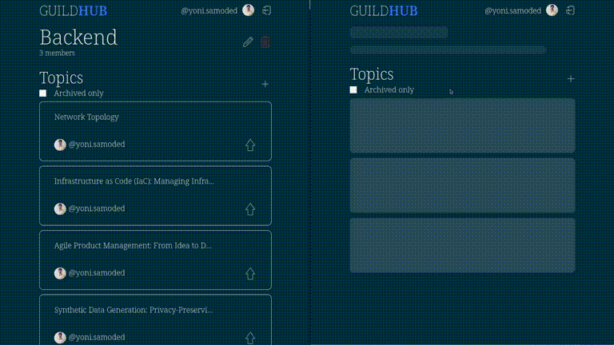

# guildhub

A place to collaborate on guild topics for in-house usage.



- Create, Update and Delete guilds
- Add and Remove members from it
- OATH integration with [gitlab](https://www.gitlab.com)
- Submit topics
- Vote on topics
- Archive topics that are done

## Gitlab

The application requires access to gitlab [how to](https://docs.gitlab.com/ee/integration/oauth_provider.html).

It fetches all of the users in the target group and holds them in cache (updating this cache once in a while).
Users that are not in the target group will not be able to login.

## Database

[MongoDB](https://www.mongodb.com/) is used as a database in this project.

`MONGO_DB_URI` - connection string env variable

## Technologies

[Rust](https://www.rust-lang.org/) with [axum framework](https://docs.rs/axum/latest/axum/) and [HTMX](https://htmx.org/) for the client side.

This is a test project to try out these technologies and I have to say - I had a lot of fun playing with htmx.

There are a lot of gaps and things to improve here, **but** I am mostly happy with functionality, considering amount of code that would be required with SPA approach for client side.

Implemented things like:

- Server Side Events
- Lazy loading
- Endless scrolling
- Form validations
- Active search and autocomplete

## Running

**env variables**

```
GITLAB_DOMAIN
GITLAB_ACCESS_TOKEN
GITLAB_GROUP_ID
GITLAB_CLIENT_ID
GITLAB_CLIENT_SECRET
GITLAB_REDIRECT_URL
APP_PORT
RUST_LOG
MONGO_DB_URI
AUTH_TOKEN_VALID_FOR_HOURS
AUTH_SECRET
RUST_BACKTRACE
```

## Running with Docker

Simple docker file could look like so:

```
FROM ubuntu:latest

ARG GUILDHUB_APP_VERSION

WORKDIR /usr/src

RUN apt update && apt install curl -y

RUN curl -L https://github.com/w00fmeow/guildhub/releases/download/${GUILDHUB_APP_VERSION}/guildhub-${GUILDHUB_APP_VERSION}.tar.gz | tar zx

WORKDIR /usr/src/guildhub-${GUILDHUB_APP_VERSION}

EXPOSE 80

CMD ["./guildhub"]
```

## License

Dual-licensed under MIT or the [UNLICENSE](https://unlicense.org/).
